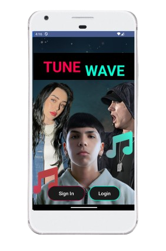
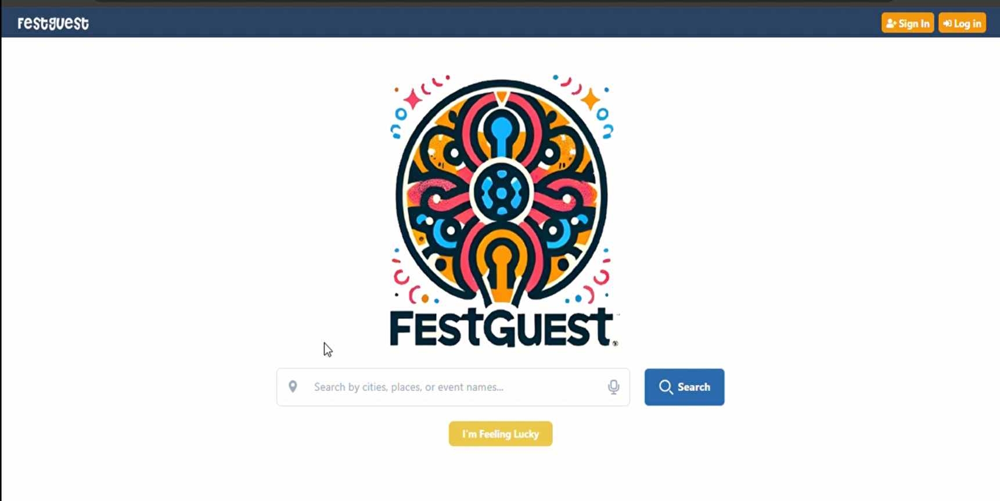
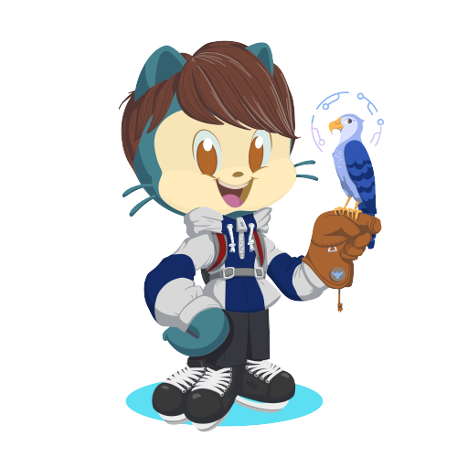

f<h1 align="center"><b>¡Bienvenido a mi perfil de GitHub!</b></h1>

</a>

  <strong>Soy Alejandro</strong>, y desde hace años, cuando mis compañeros elogiaban mis habilidades con el ordenador y mis diseños increíbles,  
  supe que la programación sería mi mundo.  

  Decidí estudiar <strong>ingeniería informática</strong> para perfeccionar aún más mis habilidades como desarrollador de software.  

  Recientemente me apasioné por el <strong>desarrollo móvil</strong> con <strong>React Native</strong>. Me encanta crear aplicaciones que la gente disfrute usar y que les hagan la vida más fácil.

 

<figure>
  
</figure>

  <ul align="center">
    

      <h2 style="display: inline-block">
        
        Tecnologías que utilizo
      </h2>
    

  </ul>

<h3>Desarrollo móvil</h3>

|                      React Native                     |                      Redux                     |                     RxJS                     |                      Kotlin                      |
| :---------------------------------------------------: | :--------------------------------------------: | :------------------------------------------: | :----------------------------------------------: |
|  |  |  |  | 

<h3>Front</h3>

|                     HTML                     |                     CSS                    |                        JavaScript                        |                        TypeScript                        |                       Angular                      |                       Tailwind                       |                        Bootstrap                       |                      jQuery                      |
| :------------------------------------------: | :----------------------------------------: | :------------------------------------------------------: | :------------------------------------------------------: | :------------------------------------------------: | :--------------------------------------------------: | :----------------------------------------------------: | :----------------------------------------------: |
|  |  |  |  |  |  |  |  |

<h3>Back</h3>

|       PostgreSQL       |       Firebase       |        SQLite        |        MySQL        |                       Supabase                       |
|:---------------------:|:-------------------:|:--------------------:|:-------------------:| :-------------------------------------------------: |
|  |  |  |  |  |

<h3>Testing, IA y Cloud</h3>

|                     Jest                     |                       Python                       |                       PyTorch                      |                     AWS                    | 
| :------------------------------------------: | :------------------------------------------------: | :------------------------------------------------: | :----------------------------------------: | 
|  |   |  |  |

## Apps 

| Proyecto | Vista previa |
| -------- | ----------- |
|  

            [🎬 Teaser](https://videonotes.carrd.co/)  &nbsp;&nbsp;&nbsp;  [🔗 Repositorio](https://github.com/AlejandroDavidArzolaSaavedra/VideoNotes-React-Native-App) | 

 |
| 
       [🎬 Teaser](https://cryptoradar.carrd.co/) [🔗 Repositorio](https://github.com/AlejandroDavidArzolaSaavedra/crypto-radar-react-native) | 

 |
| 

        [🎬 Teaser](https://bpresion.carrd.co/) &nbsp;&nbsp;&nbsp;  [🔗 Repositorio](https://github.com/AlejandroDavidArzolaSaavedra/BPresion-React-Native-App) | 

 |
| 

         [🎬 Teaser](https://dockerlabsapp.carrd.co/)  &nbsp;&nbsp;&nbsp;  [🔗 Repositorio](https://github.com/AlejandroDavidArzolaSaavedra/DockerLabs-React-Native-App)  | 

 |
|  

           [🔗 Repositorio](https://github.com/AlejandroDavidArzolaSaavedra/TuneWave) | 

 |

<h2>Proyectos Web</h2>

<table>
  <td width="50%">
    <h3 align="center">🎪 Fest Guest App</h3>
    
                                       
      
      

        <a href="https://github.com/AlejandroDavidArzolaSaavedra/FestGuest" target="_blank">
          

        </a>
	  
  
    
 
  </td>
<td width="50%">
    <h3 align="center">⚽ Merkato Kings</h3>
    

      
      

        <a href="https://github.com/AlejandroDavidArzolaSaavedra/Kings-Mercato" target="_blank">
          

        </a>
      

    
                                                                       
  </td>
</table>

<table>
  <td width="50%">
    <h3 align="center">😸 Pets-Life 🐶</h3>
    
                                       
      
       
      

        
      

     	¡Una interfaz para el cuidado de tus mascotas! Dedicada a ofrecer servicios de guardería animal, desarrollada con Angular y Firebase. Se desarrolló mientras enseñaba las bases de la programación, actuando como profesor. Desarrollada junto a @Raamonvm8.
    
                                                             
  </td>

  <td width="50%">
    <h3 align="center">🚗 Gestión de Vehículos</h3>
    
                                       
      
       
      

        
      

      
Una interfaz para la gestión de vehículos, donde los clientes pueden realizar mantenimientos y consultar los precios de la gasolina en diferentes estaciones de Gran Canaria. Desarrollada inicialmente con Angular y Firebase. Desarrollada junto a 
        <a href="https://github.com/cesardes17"  target="_blank">@CesarDelgado</a> y 
        <a href="https://github.com/o-love"  target="_blank">@o-love</a>.
      

    
                                                             
  </td>
</table>

<h2>Proyectos IA</h2>

<table>
<td width="50%">
<h3 align="center">🫡 Reconocimiento Facial con IA</h3>

<a href="https://github.com/AlejandroDavidArzolaSaavedra/Face-Recognition-IA" target="_blank">
	

Aplicación de reconocimiento facial desarrollada con métodos de inteligencia artificial evolutiva. Utiliza Python, SciPy, OpenCV y MySQL para almacenar las características faciales (embeddings) de los usuarios. El sistema permite reconocer múltiples personas simultáneamente de manera eficiente y precisa. Desarrollado con <a href="https://github.com/HeliotGonzalez" target="_blank">@HeliotGonzalez</a>.

                                                                       
</td>
<td width="50%">
<h3 align="center">👨‍⚕ Detección de Enfermedades Cerebrales con IA</h3> 

                                       

 

 A partir de diferentes técnicas de deep learning detectamos a partir de tomografias, si son cerebros con cáncer, tumores y aneurismas.
Las técnologias usadas fueron Python utilizando TensorFlow, scikit-learn, pandas, NumPy, OpenCV, Seaborn y Matplotlib. Desarrollada junto a<a href="https://github.com/AndreaSantalos"  target="_blank">@AndreaSantalos</a>.

</table>

<!--

 A deep learning application that achieves brains with cancer, tumors, and aneurysms. Developed with
  <a href="https://github.com/AndreaSantalos"  target="_blank">@AndreaSantalos</a>.

</table>
<table>

!-->
 

 

<strong>⚙️ Estadisticas de GitHub</strong>
 	

	

 	

 
 

 
 

 
</a>
<h4 style="line-height: 1.5; font-family: 'Nunito', sans-serif;">
	¡Gracias por visitar mi perfil de GitHub! 
	Espero que mis proyectos te resulten interesantes y útiles. 
	Si tienes alguna pregunta o sugerencia, no dudes en contactarme. 
	¡Espero contactar contigo pronto!  
	Última edición: 21/04/2025
</h4>

 
 

